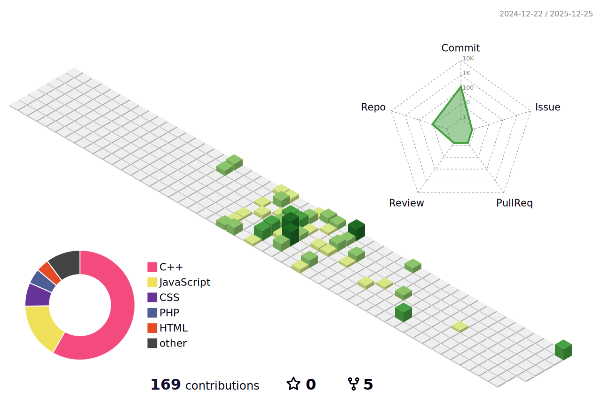

<h1 align="center">⚡ Akash Rana — Shock & Ship 👨‍💻</h1>

<h3 align="center">
  
</h3>

  <!-- Futuristic animated banner -->
  

---

## 🧑‍💻 About Me
- **SDE Intern @ Uplyx** | MERN + AI  
- **OCI Certified (Foundations Associate)**  
- **300+ commits in 2025** and counting  
- DSA in **C++/Java** | Shipping real products

📫 **sandeepekash537@email.com** • 🔗 **linkedin.com/in/akashrana100**

---

## 🚀 Tech Stack

  

---

## 📌 Featured Projects
- 🩺 [Doctor Appointment System (PHP+MySQL)](https://github.com/Akashrana1001/doctor-appointment-system)  
- 🧠 [StudyBuddy++ (C++)](https://github.com/Akashrana1001/StudyBuddy-CPP)  
- 🏢 [Multi-Tenant SaaS (MERN)](https://github.com/Akashrana1001/multi-tenant-saas)  
- 💬 [Textify (MERN + Socket.IO)](https://github.com/Akashrana1001/ChatiFi)  
- 🤖 [AI Virtual Assistant (MERN)](https://github.com/Akashrana1001/Ai-virtual-Assitant)  
- 🧠 [AI Code Reviewer (OpenAI API)](https://github.com/Akashrana1001/ai-code-reviewer)  
- 🗂️ [Portfolio (React)](https://github.com/Akashrana1001/My-Portfolio)

---

## 🏆 GitHub Achievements

  

---

## 📊 GitHub Stats (shows private + all commits)

  
  

  

---

## 🧊 3D Animated Contributions (snake alternative)
<!-- This file is generated by a GitHub Action below. Will appear after the first run. -->

  

---

## 👁️ Profile Views

  

---

## 🤝 Let’s Connect

  
  
  

  

